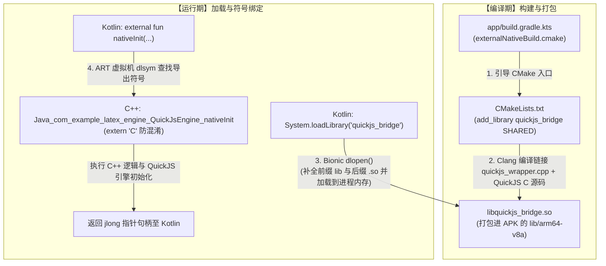

# QuickJS Android 集成与架构规范

## 1. LaTeX 转纯文本二级流水线

```text
[原始文本 + LaTeX]
       ↓ (1. QuickJS + KaTeX：将公式解析为 MathML XML 结构)
[文本 + MathML DOM 树]
       ↓ (2. Kotlin 递归 AST 处理器：映射分数/根号/上标)
[Unicode 纯文本（如 E = mc²，(-b ± √(b² - 4ac))/(2a)）]
```

## 2. JNI 胶水层：四级编译与调用链条

### 流程图 (Mermaid)



### 极简 ASCII 流程图

```text
======================= 编译期 (Compile Time) =======================
app/build.gradle.kts
   │ (externalNativeBuild: 指定 CMakeLists.txt 路径)
   ▼
CMakeLists.txt
   │ (add_library quickjs_bridge: Clang 编译 quickjs_wrapper.cpp 等)
   ▼
libquickjs_bridge.so  ──> 打包到 APK (/lib/arm64-v8a/)

======================= 运行期 (Runtime) ===========================
Kotlin: System.loadLibrary("quickjs_bridge")
   │ (底层调用 dlopen("libquickjs_bridge.so") 加载共享库到内存)
   ▼
Kotlin: external fun nativeInit(...)
   │ (触发 ART dlsym 符号查找)
   ▼
C++: Java_com_example_latex_engine_QuickJsEngine_nativeInit
   │ (extern "C" 保持纯字面量符号，成功绑定函数指针并执行)
   ▼
QuickJS C 运行时初始化 & 句柄指针 (jlong) 返回 Kotlin
```
